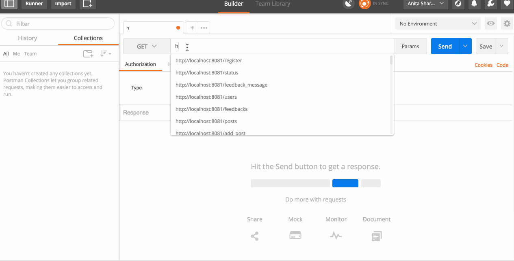
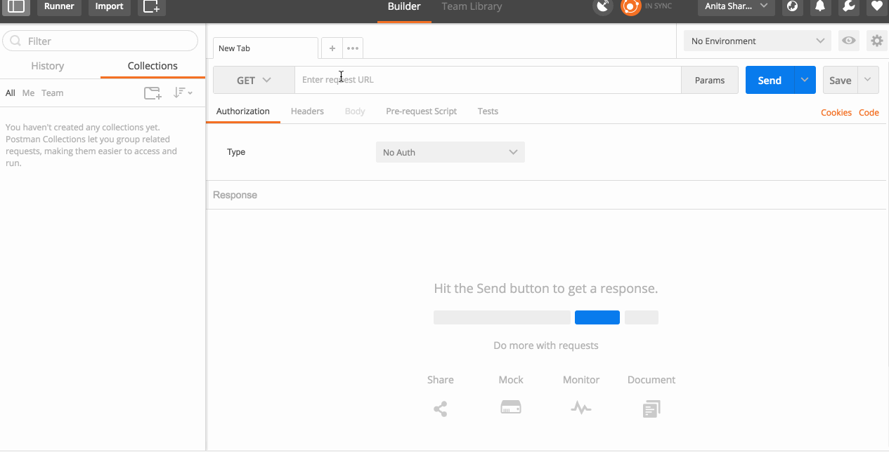

# Usage

## 1. client
In first terminal window from root of project
```bash
# run client
cd client
npm run dev

```

## 2. server
In second terminal window from root of project 
```bash
# run server
cd server
npm start
```

## 3a. using postman
### POST  : Creates a post


### GET  : Read posts


## 3b. browser

[http://localhost:8080](http://localhost:8080)
